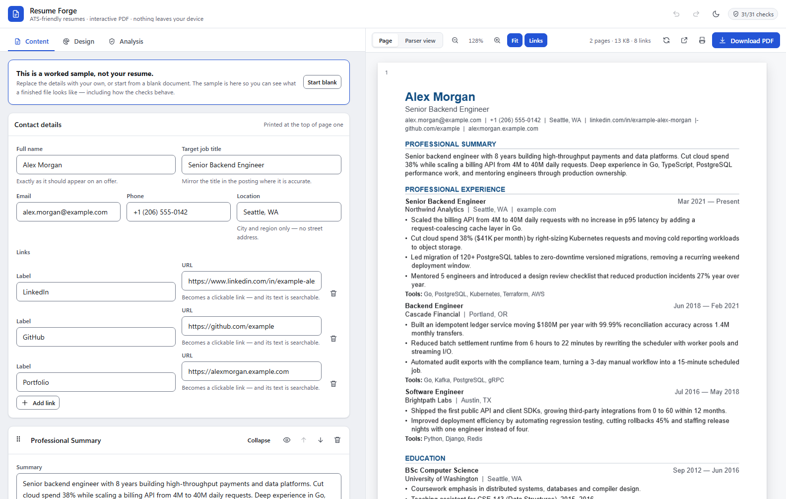
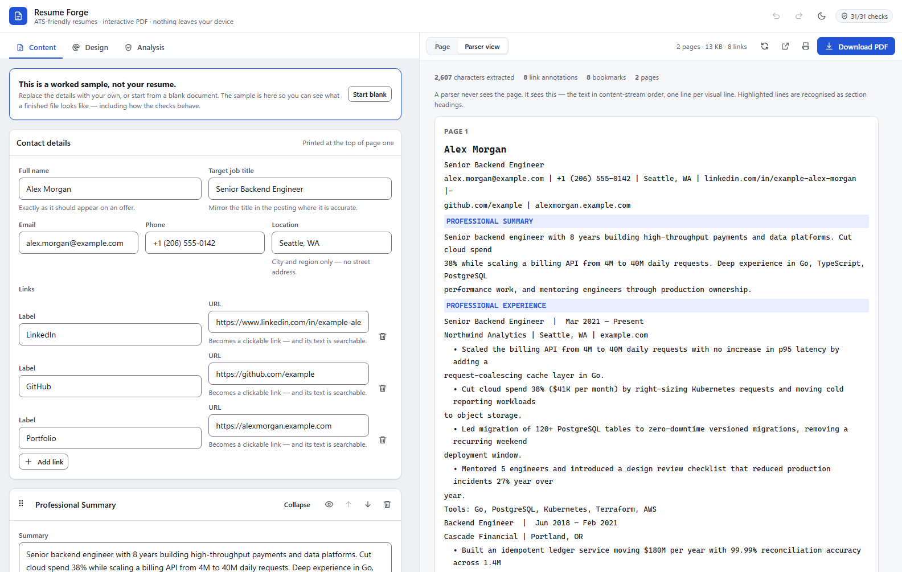
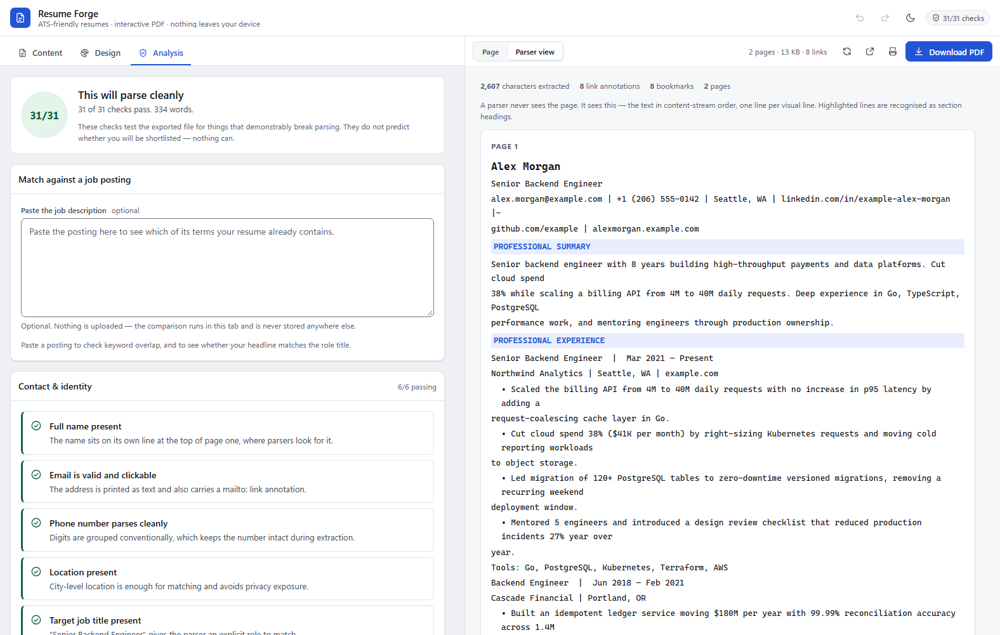

<div align="center">

# Resume Forge — Free ATS Resume & CV Builder

**Build a resume that machines can actually read. Then download it. Free, forever.**

No account · No signup · No watermark · No paywall · Nothing leaves your browser

[](#license)
[](#why-it-is-actually-free)
[](#why-it-is-actually-free)
[](#your-data-never-leaves-the-tab)
[](#what-makes-the-output-ats-safe)

</div>

<div align="center">



*The editor on the left; on the right, the real PDF — the same bytes the Download
button gives you.*

</div>

---

## What this is

A **free resume and CV builder that outputs a genuinely ATS-friendly PDF** — one
column, no tables, no text boxes, no images, real selectable text, spelled-out
dates, and a machine-readable structure that resume parsers can extract cleanly.

It also happens to be the only resume builder that shows you **what the parser
sees**, and it verifies every claim it makes against the actual bytes of the file
you download.

> Most "ATS-friendly resume builders" apply a filter over a template and *claim*
> the result is parseable. This one renders the PDF, reads it back with two
> independent PDF engines, and fails its own test suite if the text does not come
> out intact.

<div align="center">

| Parser view — what an ATS actually extracts | Analysis — 31 explainable checks |
| --- | --- |
|  |  |

</div>

## Why it is actually free

| | |
| --- | --- |
| **No account** | Open the page and start typing. There is no login, no email capture, no trial. |
| **No watermark** | The PDF you download is the PDF. Nothing is stamped on it. |
| **No download paywall** | Unlimited exports, every template, every feature, from the first second. |
| **No upload** | Your resume is built in your browser tab. There is no server to send it to. |
| **No tracking** | No analytics, no third-party scripts, no network calls at runtime. |
| **Open source** | Read every line, fork it, self-host it. |

## Your data never leaves the tab

There is no backend. The form state lives in your browser's local storage, and the
PDF is assembled in the page you are reading. Close the laptop on a plane and it
still works — including undo, the live preview, and the ATS analysis.

Paste a job description to check keyword overlap? That text is compared locally and
never transmitted anywhere.

---

## What makes the output ATS-safe

Every property below is enforced by the renderer and **asserted against the
produced bytes** by the test suite — not merely intended:

| Property | Why it matters |
| --- | --- |
| **One column, top to bottom** | Text is written in reading order. Apache Tika's documentation warns that position-sorting interleaves multi-column layouts; there are no columns here to interleave. |
| **No tables, text boxes, images or icons** | Nothing has to be reconstructed from geometry, and no text is a picture. |
| **Standard-14 PDF fonts with explicit WinAnsi encoding** | `/BaseFont /Helvetica` + `/Encoding /WinAnsiEncoding` means no font subset and no broken Unicode map to garble extraction. |
| **Spelled-out months** | A widely used parser reads dates with `%b %Y`; a numeric range can match its pattern and then silently contribute **zero months of experience**. |
| **No hyphenation** | A word split across a line with a hyphen is a word a keyword search will not find. |
| **Contact details in the page-1 body flow** | Repeating headers and footers get duplicated or dropped by extractors. |
| **Under 2.5 MB** | Greenhouse documents that it cannot parse resumes larger than 2.5 MB, despite accepting uploads up to 100 MB. |
| **Real link annotations** | Links are clickable in the downloaded file *and* their text is extractable, so both humans and parsers get them. |

### The interactive PDF you actually get

- **Clickable links** — email (`mailto:`), phone (`tel:`), LinkedIn, GitHub,
  portfolio, company and credential URLs. Unsafe schemes such as `javascript:` and
  `data:` are rejected before they can become annotations.
- **Bookmark outline** — one entry per section, navigable in any PDF reader.
- **Document metadata** — title, author, subject, keywords, language, creator, PDF 1.7.
- **Selectable, searchable text** in every template.

### See what the parser sees

The preview is the **actual PDF**, rendered from the same bytes you download — not
an HTML approximation that drifts. Switch to **Parser view** and you get the text
an ATS extracts, in reading order, with recognised section headings highlighted.

That view is where invisible failures become visible: a heading parsers do not
know, contact details stranded in a header, a keyword split by a line break.

---

## Features

**Editing**
- Structured editor for summary, experience, education, skills, projects,
  certifications, awards, publications, volunteer work and languages
- Drag to reorder sections, roles and bullet points — with visible Move up/down
  buttons and keyboard shortcuts, so nothing requires a mouse
- Autosave, full undo/redo, JSON import/export, copy as plain text
- Loads with a worked sample so you can see a finished file immediately (and a
  banner so you never send it by accident)

**Design**
- 4 parser-tested templates, accent colours, font scale, line spacing, margins,
  A4 or US Letter, heading rules, bullet characters and date formats
- Light and dark interface themes (the page itself is always paper-white)

**Analysis**
- 31 automated checks across contact details, structure, content, formatting and
  job-description match — each one explains *why* it matters and what to do
- Paste a job posting to see keyword overlap, and add missing terms to your Skills
  section in one click
- Honest by design: it leads with "31 of 31 checks pass", not a fake score out of
  100, and states plainly that it cannot predict whether you will be shortlisted

**Accessibility**
- WCAG 2.2 AA treated as a requirement: every colour pairing is contrast-verified
  in both themes, dragging always has a non-drag alternative (SC 2.5.7), targets
  are 32 px, dialogs trap and restore focus, `prefers-reduced-motion` respected

---

## Quick start

```bash
npm install
npm run dev          # http://localhost:5173
npm run build        # production bundle in dist/
npm run preview      # serve the production build on :4173
```

No environment variables, no API keys, no database. It is a static site.

---

## Verification

This project treats "verified" as a claim to earn. Three independent layers:

```bash
npm test                        # 149 unit + render assertions
npm run verify -- file.pdf      # inspect any PDF with the ATS harness
npm run verify:browser          # drive real Chrome over the DevTools Protocol
```

### 1. Unit tests

Domain logic, URL safety, character encoding, the analyser, the store's undo
model, and WCAG contrast for every colour pairing in both themes.

### 2. Render tests against real bytes

Every template is rendered to an actual PDF, and the bytes are read back with
pdf.js to assert reading order, link annotations, the bookmark tree, "no heading
stranded at the bottom of a page", and more:

```
2 page(s) · 115 text runs · 8 link annotation(s) · 8 bookmark(s)
17/17 checks passed
```

Then a **second, unrelated engine** — MuPDF, C++ compiled to WebAssembly —
must agree on ≥98% of distinct words. (`pdf-parse` and `unpdf` both wrap pdf.js,
so comparing those would be one library agreeing with itself.)

### 3. Browser verification

`scripts/verify-browser.mjs` launches your installed Chrome headless over the
DevTools Protocol (Node's built-in `WebSocket`; no Playwright or Puppeteer
download), then:

1. fails the run if the page logs any error or 404,
2. waits for the PDF pipeline and asserts painted canvases plus link overlays,
3. switches to the parser view and asserts headings were detected,
4. pastes a job description and asserts keyword matching runs,
5. **clicks Download and checks a real file lands on disk**,
6. verifies the responsive layout and that the dark theme reaches every surface,
7. captures screenshots of each view.

The downloaded file is then fed straight back into the ATS harness.

Reproduce any of it by hand:

```bash
node scripts/verify-ats.mjs .verify-out/downloads/*.pdf --dump-text
```

`--dump-text` prints the extracted text, every link annotation, the outline, and
the metadata — exactly what a parser sees.

---

## Project layout

```
src/
  domain/       data model, dates, URLs, encoding, sample resume  (pure, tested)
  ats/          the analyser: 31 explainable checks + keyword matching
  pdf/          the single renderer (templates, theme, generation)
  state/        zustand store: immutable edits, coalesced undo, autosave
  features/     editor · preview · analysis · design panels
  ui/           primitives, icons, reorder hook, error boundary
  styles/       design tokens (contrast-tested) + application CSS
scripts/
  verify-ats.mjs        ATS harness CLI
  verify-browser.mjs    end-to-end Chrome verification
  lib/                  pdf.js + MuPDF loaders, inspection core, assertions
docs/research/          the primary-source research this is built on
```

## Research

Four documents in `docs/research/` record what the design is based on, with
sources, and separate strong evidence from folklore:

- `ats-parsing.md` — how ATS actually ingest resumes, and the failure modes of
  each extraction stack (28-item testable checklist).
- `pdf-engine.md` — engine selection, empirically verified.
- `pdf-verification.md` — which tools are genuinely independent, and why
  `pdf-parse` + `unpdf` + `pdfjs-dist` are the same parser three times.
- `ux-design.md` — competitive teardown, WCAG 2.2 obligations, design tokens.

## Keyboard

| Key | Action |
| --- | --- |
| `Ctrl/⌘ Z` / `Ctrl/⌘ ⇧ Z` | Undo / redo |
| `Ctrl/⌘ S` | Download the PDF |
| `Ctrl/⌘ ⇧ ↑ ↓` | Move the focused achievement |
| `Ctrl/⌘ Enter` | Remove the focused achievement |
| `1` `2` `3` | Content / Design / Analysis |

## Tech

React 19, TypeScript (strict), Vite 7, zustand, `@react-pdf/renderer`,
`pdfjs-dist`. The renderer (~600 KB) and pdf.js are both lazy-loaded, so the
editor paints before either arrives.

## Limitations, stated plainly

- **The PDF is not tagged** (`/StructTreeRoot`). The library cannot emit tagged
  output yet and fails silently if asked, so this project does not claim it.
  Tagging helps screen readers; it is not used by ATS parsers, which read the
  content stream and font encodings.
- **The analysis cannot predict shortlisting.** It checks the things that
  demonstrably break parsing. Nothing more.
- **No DOCX export.** ATS handle PDF reliably; a second format would double the
  surface area for silent breakage.

## License

MIT — see [LICENSE](LICENSE). Use it, fork it, self-host it, ship it in your own
product. Attribution is appreciated but not required.
